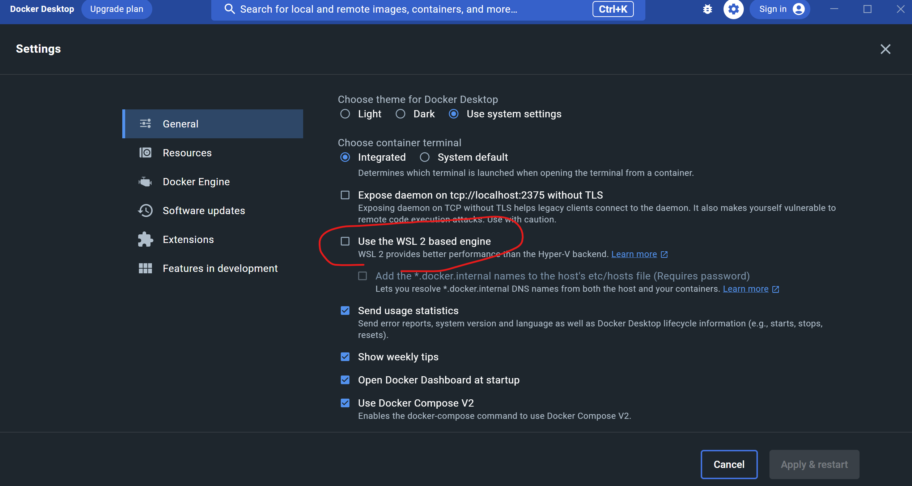

# ASP.NET Core WebApp を docker の Windows Container で動かすサンプル。

## Local PC で実行
### 前提条件
- Windows PC であること
- Docker Desktop がインストールされていること

### Dccker Engine の確認
1. Docker Desktop を起動。
2. 下記コマンド実行。"OS/Arch:"がWindowsになっていればOK
```
docker version
```
```
Client:
 Cloud integration: v1.0.31
 Version:           23.0.5
 API version:       1.42
 Go version:        go1.19.8
 Git commit:        bc4487a
 Built:             Wed Apr 26 16:20:14 2023
 OS/Arch:           windows/amd64 ← ★これ
 Context:           default

Server: Docker Desktop 4.19.0 (106363)
 Engine:
  Version:          23.0.5
  API version:      1.42 (minimum version 1.24)
  Go version:       go1.19.8
  Git commit:       94d3ad6
  Built:            Wed Apr 26 16:17:54 2023
  OS/Arch:          windows/amd64 ← ★これ
  Experimental:     false
```


### Docker Engine の変更
- 前手順で"OS/Arch"がLinuxになっていた場合下記の手順でWindowsのDocker Engineに変更する。  
1. "Use the WSL 2 based engine"のチェックを外す。
  
2. 下記コマンドを実行。(2個めのコマンドは管理者で)
```
& $Env:ProgramFiles\Docker\Docker\DockerCli.exe -SwitchWindowsEngine
Enable-WindowsOptionalFeature : The requested operation requires elevation.
```

### docker build & run
1. docker desk top が起動されていること。
2. 下記コマンドでbuild & run (image名とコンテナ名は適宜付けてあげる)
```
docker build -t asp_net_core_sample_image -f ./AspNetCoreWithDockerSample/Dockerfile .
docker run -it --rm -p 5000:80 --name asp_net_core_sample_container asp_net_core_sample_image
```
